# iMark - 智能阅卷系统

本项目旨在设计和实现一个支持**智能化自动阅卷**，提供**AI自动识别**、**自动评分**、**智能评价**和**数据分析服务**的软件平台，并且能够同时在桌面和移动端提供服务。

现阶段项目以 *大学数据结构与算法期末考试* 情景为切入点，重点解决基本阅卷过程中的一些问题，包括:

- 试卷识别和存储
- 不同题型自动评阅
- 批阅结果智能分析

***首先*** 识别和存储录入的试卷，分析其中的知识点、题型、难度等属性，并构建相应的知识图谱，为后续的智能阅卷提供基础。

对于 *客观题*，主要研究通过图像识别技术自动识别学生的答案，并进行相应的评分。

对于 *主观题*，主要研究利用语言大模型自动理解学生的答案，并评估其内容的正确性、逻辑性和表达的清晰度等。

智能阅卷平台 ***还需要*** 利用人工智能技术对阅卷结果进行分析和处理，为教师提供教学建议和优化方案，提高教学质量和效果。 ***最后*** ，搭建起软件系统平台承载服务，并在桌面和移动端提供支持。

## Demo

访问此链接在线体验：[iMark - 智能阅卷系统](http://114.132.51.87/)


## 核心流程

情景假设：大学操作系统期末考试

**1. 内容提取**

这一步主要实现录入试卷，识别并拆分个人信息、问题与作答。借助 [PaddleOCR](https://gitee.com/paddlepaddle/PaddleOCR/tree/release/2.6) 实现试卷内容的自动识别分析，并根据识别结果进行裁剪。

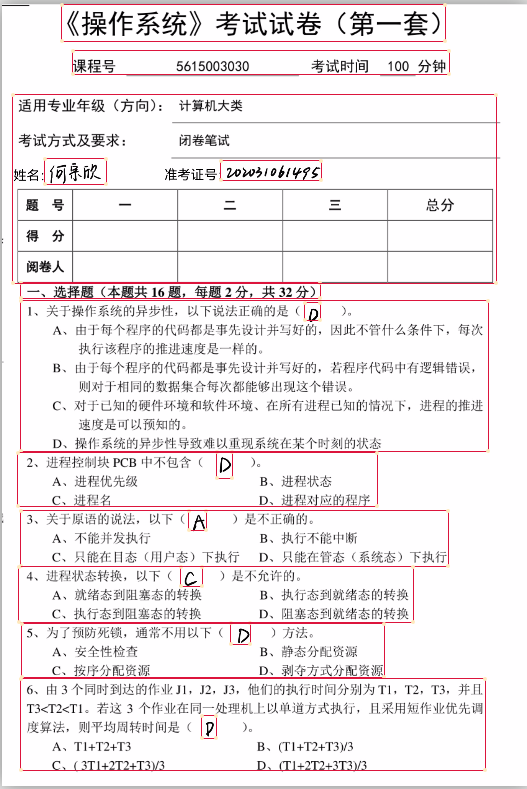

**2. 理解批阅**

由 AI 理解录入的信息，并产生批阅结果，包括分数和评语。这里使用了百度[文心大模型](https://ernie-bot-agent.readthedocs.io/zh-cn/latest/)作为 AI 支持。

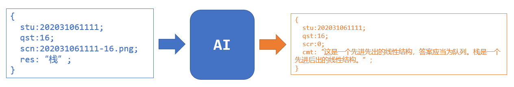

**3. 二次编辑**

在服务端对产生的结果进行二次编辑，以便整理和理解。主要是进行数据的整理、清洗和统一。

**4. 整理和可视化**

将原始数据整理成统计数据，并可视化产出。

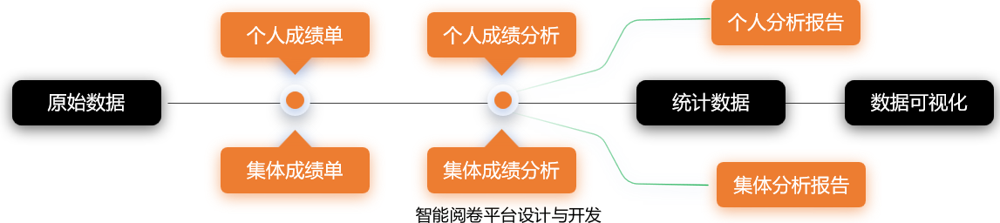


## 使用示例

**1. 登录**

**2. 创建考试**

**3. 录入试卷**

**4. 录入答卷**

**5. 开始阅卷**

**6. 生成结果**

**7. 更多**


## 架构与设计

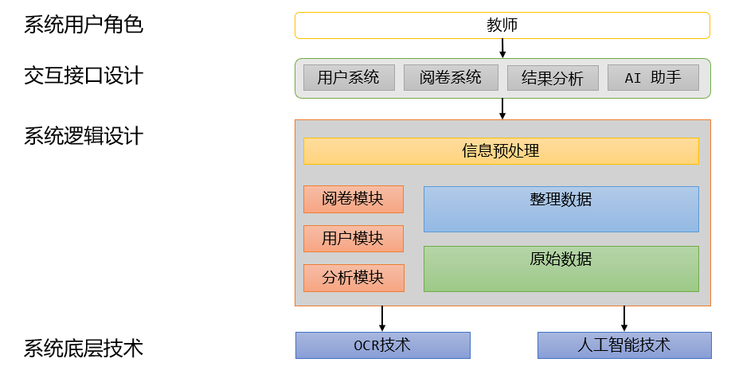

**1. 用户角色**

项目专门面对教师提供服务。用例图如下：

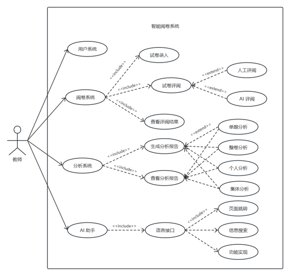

**2. 试卷录入设计**

点击“开始录入”后，可以选择向系统导入一张或多张扫描文件。对于导入的每一份文件，系统先判断文件格式是否支持（pdf / png / jpg）,对于受支持的文件再由OCR理解确认其类型。

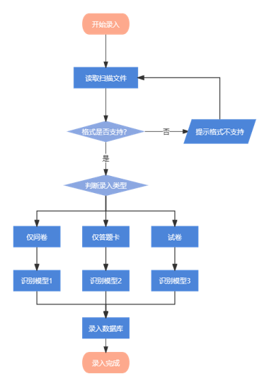

确认类型后立即进行内容识别。

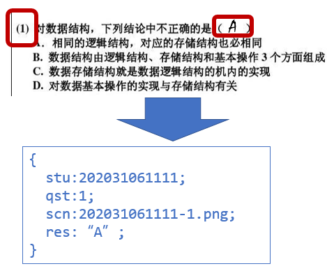


**2. 阅卷流程设计**

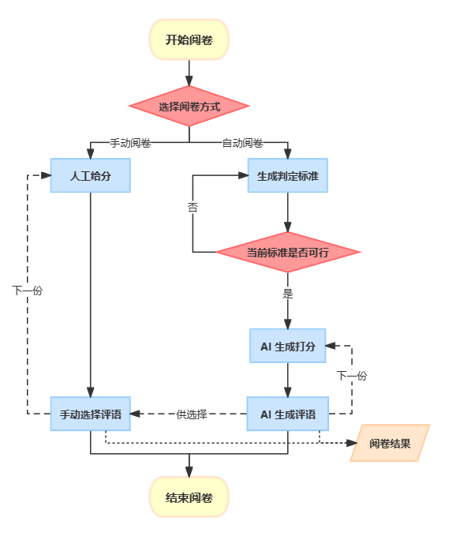


## 部署与开发

本项目采用分布式前后端开发，前端、业务逻辑处理、人工智能与图片处理模块分开部署。

（以下命令默认在 CentOS7 操作系统下进行）

### 1. 人工智能与图片处理模块

#### **1.1 环境**

- **下载 Anaconda**

```shell
sudo yum install wget
wget https://mirrors.tuna.tsinghua.edu.cn/anaconda/archive/Anaconda3-2021.05-Linux-x86_64.sh
```

- **安装 Anaconda**

```shell
sh Anaconda3-2021.05-Linux-x86_64.sh #按照安装提示安装即可
```

- **将conda加入环境变量**
  
  - 在终端中打开 `~/.bashrc` ：
  
    ```shell
      # 在终端中输入以下命令：
      vim ~/.bashrc
    ```

  - 在 `~/.bashrc` 中将conda添加为环境变量：

    ```shell
      # 先按i进入编辑模式
      # 在第一行输入：
      export PATH="~/anaconda3/bin:$PATH"
      # 若安装时自定义了安装位置，则将~/anaconda3/bin改为自定义的安装目录下的bin文件夹
    ```

  - 修改 `~/.bash_profile` ：

    ```shell
      # 修改后的~/.bash_profile文件应如下（其中xxx为用户名）：
      export PATH="~/opt/anaconda3/bin:$PATH"
      # >>> conda initialize >>>
      # !! Contents within this block are managed by 'conda init' !!
      __conda_setup="$('/Users/xxx/opt/anaconda3/bin/conda' 'shell.bash' 'hook' 2> /dev/null)"
      if [ $? -eq 0 ]; then
          eval "$__conda_setup"
      else
          if [ -f "/Users/xxx/opt/anaconda3/etc/profile.d/conda.sh" ]; then
              . "/Users/xxx/opt/anaconda3/etc/profile.d/conda.sh"
          else
              export PATH="/Users/xxx/opt/anaconda3/bin:$PATH"
          fi
      fi
      unset __conda_setup
      # <<< conda initialize <<<
    ```

  - 修改完成后，先按`esc`键退出编辑模式，再输入`:wq!`并回车，以保存退出
  
- **验证是否能识别conda命令：**

  - 在终端中输入`source ~/.bash_profile`以更新环境变量

  - 再在终端输入`conda info --envs`，若能显示当前有base环境，则conda已加入环境变量

- **创建新的conda环境**

```shell
# 在命令行输入以下命令，创建名为paddle_env的环境
# 此处为加速下载，使用清华源
conda create --name paddle_env python=3.8 --channel https://mirrors.tuna.tsinghua.edu.cn/anaconda/pkgs/free/
```

- **激活刚创建的conda环境，在命令行中输入以下命令：**
  
```shell
# 激活paddle_env环境
conda activate paddle_env
```

以上anaconda环境和python环境安装完毕

#### **1.2 拉取项目**

确保在 `paddle_env` 环境下：

- 安装 `git`

```shell
yum install git
```

- 获取项目

```shell
cd ~
mkdir imark & cd imark
mkdir statics
git clone https://gitee.com/genshin_ayanami/i-mark.git
```

完成之后在 `/root/imark` 路径下会存在一个 `i-mark` 文件夹和一个 `statics` 文件夹


#### **1.3 编辑配置**

- 安装 `uwsgi`
  
```shell
pip install uwsgi
```

- 编写 `uwsgi.ini` , 修改为自己的配置

```shell
vim /root/imark/uwsgi.ini
```

```shell
# uwsgi.ini file
[uwsgi]

# Django-related settings

# 端口号
http = :8008

# the base directory (full path)
chdir           =/root/imark/i-mark/demo

# 静态文件访问映射
static-map=/files/download=/root/imark/i-mark/demo/upload/imgs

# Django s wsgi file
module          = server.wsgi:application
wsgi-file=server/wsgi.py

# process-related settings
# master
master          = true

# maximum number of worker processes
processes       = 4

# ... with appropriate permissions - may be needed
# chmod-socket    = 664
# clear environment on exit
vacuum          = true

```

- 获取文心一言 Access Token,访问：[https://aistudio.baidu.com/index/accessToken](https://aistudio.baidu.com/index/accessToken)

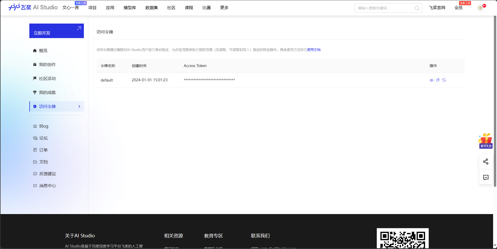

申请后点击复制键复制自己的token

- 编写项目配置文件

  - 根据定位访问 `settings.py`

  ```
  | i-mark
  | - demo
  | | -- aibit
  | | -- ocr
  | | -- seg
  | | -- server
  | | | --- settings.py
  ...
  ```

  - 在文件中替换为自己的 token

  ```python
    os.environ["EB_AGENT_ACCESS_TOKEN"] = "<access token>"
  ```

  - 更改为自己的服务器地址
  
  ```python
    SERVER_PATH = 'http://127.0.0.1:8000/'
  ```

  - 根据需要选择是否开启 Debug
  
  ``` python
    DEBUG = True # 能看到内部和报错信息
  ```

- 安装依赖

在 `/root/imark/i-mark/demo/` 下：

```shell
pip3 install -r requirements.txt
```


#### **1.4 开启服务**

在 `uwsgi.ini` 文件的位置下（一般是 `/root/imark/` ）：

```shell
uwsgi uwsgi.ini
```

关于 uwsgi 命令，请参考：[uwsgi](https://uwsgi-docs-zh.readthedocs.io/zh-cn/latest/)


### 2. 业务逻辑处理模块


### 3. 前端


## 文档

[TODO](./md/doc/)


## 技术栈

**1. Paddle OCR**


https://github.com/PaddlePaddle/PaddleOCR/tree/release/2.7

PaddleOCR 旨在打造一套丰富、领先、且实用的OCR工具库，助力开发者训练出更好的模型，并应用落地。支持多种OCR相关前沿算法，在此基础上打造产业级特色模型PP-OCR、PP-Structure和PP-ChatOCRv2，并打通数据生产、模型训练、压缩、预测部署全流程。

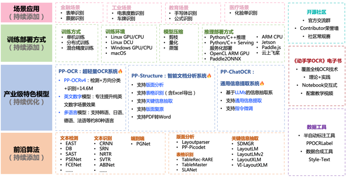

覆盖20+高频应用场景，支持5种文本图像智能分析能力和部署，包括通用场景关键信息抽取（快递单、营业执照和机动车行驶证等）、复杂文档场景关键信息抽取（解决生僻字、特殊标点、多页pdf、表格等难点问题）、通用OCR、文档场景专用OCR、通用表格识别。针对垂类业务场景，也支持模型训练、微调和Prompt优化。


**2. 文心一言语言大模型 ErnieBot**


https://github.com/PaddlePaddle/ERNIE-Bot-SDK

ERNIE Bot SDK 仓库包含两个项目：ERNIE Bot Agent 和 ERNIE Bot。

- **ERNIE Bot Agent**
是百度飞桨推出的基于文心大模型编排能力的大模型智能体开发框架，结合了飞桨星河社区的丰富预置平台功能。

- **ERNIE Bot** 
作为 ERNIE Bot Agent 的底层依赖，为开发者提供了便捷易用的接口，使其能够轻松调用文心大模型的强大功能，涵盖了文本创作、通用对话、语义向量以及AI作图等多个基础功能。

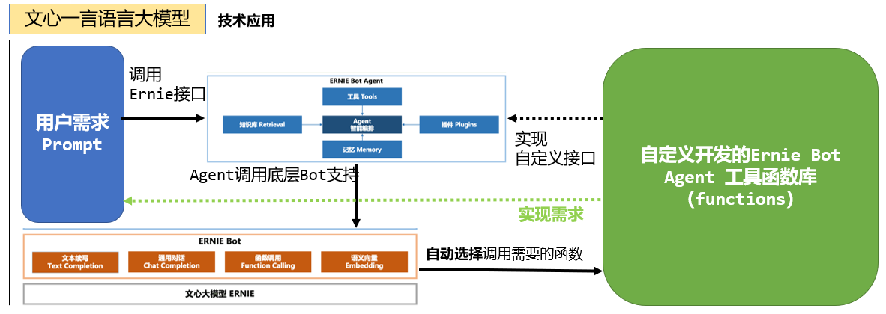


**3. DRF - Django REST Framework**


https://www.django-rest-framework.org/

Django REST framework 框架是一个用于构建Web API 的强大而又灵活的工具

特点：

- 提供了定义序列化器Serializer的方法，可以快速根据 Django ORM 或者其它库自动序列化/反序列化；
- 提供了丰富的类视图、Mixin扩展类，简化视图的编写；
- 多种身份认证和权限认证方式的支持；
- 直观的 API web 界面。

**4. Vue3**

https://cn.vuejs.org/

Vue  是一款用于构建用户界面的 JavaScript 框架。它基于标准 HTML、CSS 和 JavaScript 构建，并提供了一套声明式的、组件化的编程模型，帮助你高效地开发用户界面。无论是简单还是复杂的界面，Vue 都可以胜任。


